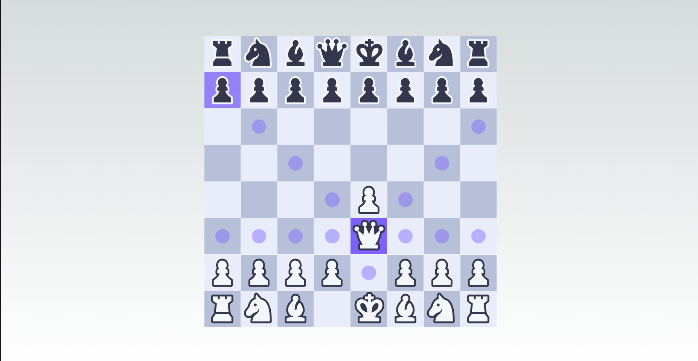

## Chess Game Details

**chesster.io** is a web-based chess game that allows users to play chess online through their web browser. The game is built using Next.js, React, and TypeScript, providing a seamless and interactive chess experience.

### Implemented Features

- **Responsive Design**: Enjoy the game on any device, from desktop to mobile.
- **Game Logic**: The core logic of the chess game, including rules and gameplay mechanics.
- **Board Design**: The visual representation of the chessboard, including the layout and styling.
- **Piece Movements**: Detailed implementation of all chess piece movements according to the rules of chess.

### TODO
- **Player Profiles**: Allow users to create profiles and track their progress.
- **Game Lobby**: Implement a lobby system for players to join games or create new ones.
- **Chat Functionality**: Add a chat feature for players to communicate during the game.
- **Game Notifications**: Notify players of their turn or when a game ends.
- **Game Statistics**: Provide statistics on player performance and game outcomes.
- **Attack Logic**: Implement the logic for determining valid attacks and captures.
- **Scoring Algorithm**: Develop an algorithm to calculate scores based on game outcomes.
- **Online Multiplayer**: Play against friends or random opponents from around the world.
- **AI Opponent**: Challenge the AI to improve your chess skills.
- **Game History**: Review your past games and learn from your mistakes.
- **Customizable Board**: Personalize your chessboard with different themes and piece sets.
## Technologies

The following technologies are used in the development of **chess.io**:

- **Next.js**: A React framework for building server-rendered applications with ease.
- **React**: A JavaScript library for building user interfaces, particularly single-page applications.
- **TypeScript**: A statically typed superset of JavaScript that adds optional types to the language, enhancing developer productivity and code quality.
- **Redux**: A predictable state container for JavaScript apps, often used with React to manage application state.
- **ESLint**: A tool for identifying and reporting on patterns found in ECMAScript/JavaScript code, with the goal of making code more consistent and avoiding bugs.
- **CSS Modules**: A CSS file in which all class names and animation names are scoped locally by default.
- **Font Optimization**: A feature of Next.js that allows you to optimize the loading of web fonts.

These technologies are chosen for their ability to create a modern, interactive, and performant web-based chess game that can be easily maintained and extended.

### Contributing

We welcome contributions to improve the game. If you have ideas for new features or want to fix bugs, please feel free to submit a pull request or open an issue.
